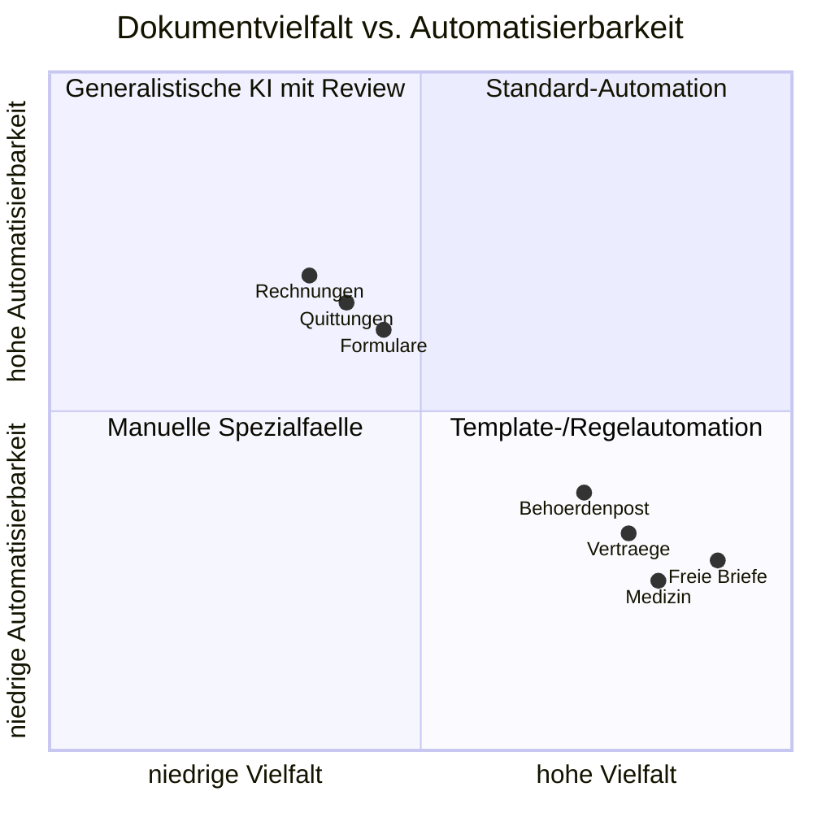
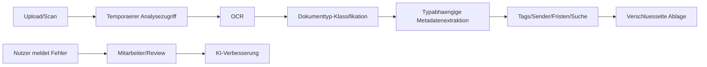
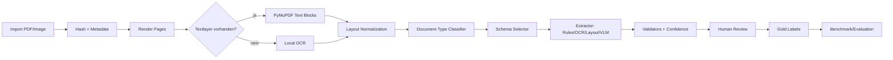
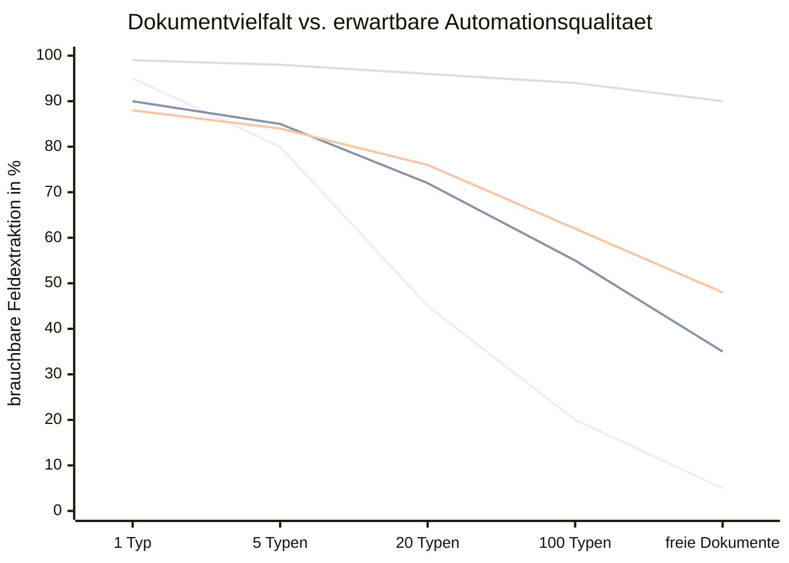
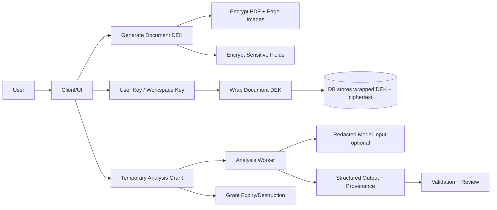

# Document-AI fuer pdf2json: Technischer Long-Report

Status: Long-Report-Fassung nach definierten Akzeptanzkriterien abgeschlossen. Offen sind optionale Ausfuehrungsschritte: PDF-Rendering, Azure-Calculator-Runde und echte Benchmarks.

Letzte Bearbeitung: 2026-06-10

## 0. Executive Summary

### Kernaussage

`pdf2json` sollte nicht als "ein Modell erkennt alle PDFs perfekt" gedacht werden. Der realistische technische Kern ist eine Document-AI-Workbench:

- robuste lokale Dokumentaufnahme
- OCR/Textlayer/Layout-Extraktion
- Dokumenttyp-Klassifikation
- feld- und relationsbasierte Extraktion
- VLM/LLM als Silver-Labeler
- menschliche Review-UI als Gold-Dataset-Maschine
- eigene Benchmarks pro Dokumentklasse
- Security-by-design fuer private und sensible Dokumente

Die wichtigste Produktentscheidung ist die Begrenzung der ersten Dokumentbreite. Je mehr Dokumenttypen in v1 unterstuetzt werden, desto allgemeiner, teurer und unsicherer wird die Loesung. Ein MVP sollte deshalb nicht "alle deutschen Dokumente" versprechen, sondern eine priorisierte Taxonomie bearbeiten:

1. Formulare und formularaehnliche Dokumente
2. Rechnungen und Quittungen
3. Versicherungs- und Vertragsdokumente mit klaren Metadaten
4. Behoerdenpost mit Fristen/Absender/Aktenzeichen
5. erst spaeter medizinische Dokumente, komplexe freie Briefe und breite E-Mail-Kontexte

### Wichtigste Marktbeobachtungen

- fileee ist oeffentlich als Endnutzer-Dokumentenassistent positioniert, nicht als generisches Entwickler-API fuer Document Labeling. fileee beschreibt automatische Dokumenttyp-Erkennung, Metadatenextraktion, Volltextsuche, Tags und eine Feedback-Schleife, bei der Nutzer falsch erkannte Dokumente zur Analyseverbesserung einreichen koennen. Quelle: `S001`.
- fileee nennt derzeit 10 Dokumenttypen. Das ist strategisch wichtig: selbst ein reifes Produkt begrenzt die oeffentliche Typabdeckung und arbeitet offenbar typabhaengig. Quelle: `S001`.
- fileee beschreibt eine hybride Verschluesselung mit temporaerem Analysezugriff: beim Upload wird ein symmetrischer Dokument-Key erzeugt; fuer OCR/Analyse bekommt fileee einen Uebergangsschluessel, der nach Abschluss vernichtet wird. Quelle: `S002`.
- Google, Azure und AWS zerlegen das Problem in mehrere Modelle/Operationen: OCR/Layout, Form Parser, prebuilt invoice/receipt/ID/contract models, custom classifiers, custom extractors, query-based extraction. Das bestaetigt: eine serioese Loesung ist Pipeline-orientiert, nicht ein einzelner Prompt.
- Open Source ist fuer `pdf2json` besonders interessant: Docling bietet lokale Verarbeitung, PDF-Layout, Reading Order, Tabellen, mehrere Dateiformate, JSON/Markdown-Export und VLM-Pipelines. Marker bietet PDF-to-Markdown/JSON und veroeffentlicht eigene Benchmark-Hinweise fuer Tabellen. docTR ist eine lokale Deep-Learning-OCR-Option.

### Wichtigste technische Risiken

- OCR-Fehler pflanzen sich in jede nachgelagerte Extraktion fort.
- VLM/LLM-Ausgaben koennen plausibel, aber falsch sein; Confidence-Werte sind nicht automatisch kalibriert.
- Tabellen, mehrseitige Dokumente, verschachtelte Formulare und freie juristische Sprache sind deutlich schwerer als einfache Key-Value-Felder.
- Oeffentliche Genauigkeitswerte von Anbietern sind oft nicht vergleichbar, weil Dokumentklassen, Felder, Sprachen, Scanqualitaet und Messmethoden fehlen.
- Datenschutz und Analyse stehen in Spannung: echte Ende-zu-Ende-Verschluesselung erschwert OCR, Volltextsuche und KI-Analyse.

### Empfohlene Richtung fuer pdf2json

MVP:

- lokale PDF-/Bildaufnahme
- PyMuPDF/Textlayer plus OCR-Fallback
- Seitenrendering und normalisierte Bounding Boxes
- VLM/LLM nur als optionaler Silver-Labeler
- Review-UI fuer Gold Labels
- Exportformate JSON, COCO/aehnlich, Benchmark-Splits
- keine unverschluesselte Speicherung sensibler Feldwerte ohne Sensitivitaetsklassifikation

v1:

- Dokumenttyp-Taxonomie fuer deutsche Alltagsdokumente
- Evaluations-Dashboard
- Anbieter-/Tool-Benchmark gegen Google/Azure/AWS/Docling/Marker
- Feldschema pro Dokumentklasse
- Confidence- und Validation-System

v2:

- hybride Pipeline: lokal default, Cloud optional, VLM optional
- Active Learning
- spezialisierte Modelle fuer Rechnungen/Formulare
- Envelope Encryption und temporaere Analysefreigaben
- verschluesselter Volltext nur mit bewusst akzeptiertem Leakage-Modell oder lokaler Suche

## 1. Problemdefinition

### Was "PDF analysieren und labeln" technisch bedeutet

PDF-Dokumentanalyse besteht aus mehreren separaten Aufgaben. Diese Aufgaben werden in Produktkommunikation oft vermischt, muessen fuer `pdf2json` aber getrennt modelliert werden:

| Aufgabe | Input | Output | Typische Fehler | Relevanz fuer pdf2json |
|---|---|---|---|---|
| PDF-Ingestion | PDF, Bild, Scan | Seiten, Metadaten, Dateihash | kaputte PDFs, eingebettete Bilder, Rotation | Basis fuer alles |
| Rendering | PDF-Seite | Pixelbild + Dimensionen | falsche DPI, abgeschnittene Seiten | wichtig fuer VLM und BBox |
| Textlayer-Extraktion | PDF intern | Text + Koordinaten | falsche Reihenfolge, fehlende Zeichen | schnell, aber nicht immer vorhanden |
| OCR | Bild/Scan | Text + Koordinaten | schlechte Scans, Handschrift, Tabellen | noetig fuer gescannte Dokumente |
| Layout Parsing | Text/Bild | Abschnitte, Tabellen, Felder | mehrspaltige Dokumente, Lesereihenfolge | wichtig fuer Struktur |
| Dokumenttyp-Klassifikation | Seite/Dokument | Klasse/Subklasse | Mischdokumente, mehrseitige Pakete | entscheidet Schema/Pipeline |
| Key-Value-Extraction | Layout/Text | Label-Wert-Paare | falsche Zuordnung, Synonyme | Kern fuer Formulare |
| Entity Extraction | Text/Layout | IBAN, Betrag, Datum, Name | Kontextfehler, Mehrdeutigkeiten | Kern fuer Metadaten |
| Relation Extraction | Felder/BBox/Text | Label->Feld, Gruppe, Tabelle | Abstand/Lesereihenfolge irrefuehrend | wichtig fuer Labeling |
| Human Review | Silver Labels | Gold Labels | UI-Friktion, inkonsistente Annotatoren | macht Datensatz wertvoll |
| Evaluation | Gold vs. Prediction | Metriken | falsche Ground Truth, zu kleine Samples | steuert Produktqualitaet |

Der Kernfehler vieler Document-AI-Ansaetze ist, diese Ebenen zu ueberspringen und direkt ein LLM zu fragen: "Extrahiere JSON." Das kann fuer Demos funktionieren, erzeugt aber in Produktion drei Probleme:

- keine stabile Provenance: Wo auf der Seite steht der Wert?
- keine gute Fehlerdiagnose: War OCR, Layout, Klassifikation oder LLM falsch?
- keine saubere Evaluation: Man weiss nicht, welche Pipeline-Komponente verbessert werden muss.

### Warum breite Dokumentvielfalt die Loesung schwer macht

Dokumente unterscheiden sich in mindestens acht Dimensionen:

- Format: PDF mit Textlayer, Scan-PDF, Foto, DOCX, E-Mail, HTML, Screenshot.
- Sprache: Deutsch, Englisch, Mischsprache, Fachsprache.
- Layout: einspaltig, mehrspaltig, Tabellen, Formulare, Freitext.
- Struktur: wiederkehrendes Template vs. frei formulierter Brief.
- Datenziel: Volltextsuche, Metadaten, Felder, Fristen, Klauseln, Tabellen.
- Fehlerkosten: falsches Datum in Werbung vs. falsche Frist in Behoerdenpost.
- Datenschutz: harmlose Rechnung vs. Gesundheits-/Bankdaten.
- Nutzungsmodus: Archivieren, Suchen, Bezahlen, Fristen, Training, Export.

Mit steigender Dokumentbreite sinkt die Wirkung von Templates. Die Loesung muss dann allgemeiner werden:

- von Regex zu ML
- von ML zu VLM/LLM plus Validierung
- von einzelner Genauigkeit zu Confidence + Review
- von Produktfunktion zu Datensatz- und Evaluationssystem

## 2. Ausgangspunkt: pdf2json

Die lokale Analyse des vorhandenen Projekts zeigt:

- Backend: FastAPI, SQLite, Dateispeicher.
- Dokumentmodell: Dokumente, Seiten, Textblocks, Felder, Relationen, Gruppen, Model Runs.
- Analyse: PyMuPDF/Textlayer/Rendering, optional Pillow fuer Bilddimensionen.
- VLM/LLM: OpenRouter-kompatible Vision-Modelle zur Formularerkennung.
- UI: React-Workbench mit Seitenoverlay, Feldeditor und Reviewstatus.
- Export: JSON/COCO/Benchmark-orientierte Daten.

Bewertung:

- `pdf2json` ist bereits naeher an einer Annotierungs- und Benchmark-Workbench als an einem simplen PDF-Konverter.
- Besonders wertvoll sind Provenance, Bounding Boxes, Relations und Gold/Silver-Reviewkonzept.
- Die groesste strategische Luecke ist nicht "noch ein Modell", sondern ein sauberer Dokumenttyp- und Evaluationsrahmen.
- Die groesste technische Luecke ist eine robuste lokale OCR/Layout-Pipeline fuer Scans, Tabellen, Reading Order und mehrseitige Dokumente.
- Die groesste Produktluecke ist ein Security-Modell fuer private Dokumente und sensible Felder.

## 3. Dokumenttypen- und Schwierigkeitsmatrix

| Dokumentklasse | Beispiele | Typische Felder | Schwierigkeit | Fehlerkosten | Datenschutzrisiko | Geeignete Pipeline | Relevanz |
|---|---|---|---:|---:|---:|---|---:|
| Rechnungen | Handwerker, Online-Shop, SaaS | Betrag, MwSt., Rechnungsnr., Datum, IBAN, Positionen | 3 | 4 | 4 | OCR/Layout + Invoice-Schema + Review | 5 |
| Quittungen | Supermarkt, Restaurant, Tankstelle | Datum, Betrag, Haendler, MwSt., Positionen | 3 | 2 | 2 | OCR + Receipt-Schema + Plausibilitaet | 4 |
| Vertraege | Miete, Mobilfunk, Versicherung | Parteien, Laufzeit, Kuendigung, Fristen, Betrag | 5 | 5 | 4 | OCR/Layout + Abschnittserkennung + LLM mit Quellenstellen + Review | 5 |
| Behoerdenpost | Bescheid, Mahnung, Aufforderung | Absender, Aktenzeichen, Frist, Betrag, Rechtsbehelf | 5 | 5 | 5 | Klassifikation + Entity Extraction + Fristenvalidierung + Review | 5 |
| Versicherungen | Police, Schaden, Beitragsanpassung | Vertragsnr., Beitrag, Deckung, Laufzeit, Schaden | 4 | 5 | 4 | typabhaengiges Schema + Tabellen/Abschnitte | 4 |
| Bank/Finanzen | Kontoauszug, Kredit, SEPA | IBAN, BIC, Betrag, Transaktionen, Zinssatz | 5 | 5 | 5 | Tabellenextraktion + Field Encryption + Review | 4 |
| Steuer | Steuerbescheid, Lohnsteuer | Steuer-ID, Zeitraum, Betrag, Finanzamt, Frist | 5 | 5 | 5 | OCR/Layout + domänenspezifische Validierung | 4 |
| Medizin | Befund, Rezept, Krankenkasse | Diagnose, Medikamente, Versicherten-ID | 5 | 5 | 5 | lokal-first, Redaction, Review, keine Cloud default | 3 |
| Formulare | Antraege, Checklisten | Labels, Eingabefelder, Checkboxen, Unterschrift | 4 | 4 | 4 | Layout + Key-Value + Relation Extraction + VLM | 5 |
| Identitaetsdokumente | Ausweis, Pass, Fuehrerschein | Name, Geburtsdatum, Nummer, MRZ | 4 | 5 | 5 | Spezialmodell + strikte Security + Audit | 3 |
| E-Mail/Anhaenge | Mailbody + PDF/DOCX | Sender, Datum, Anhaenge, Kontext | 4 | 4 | 4 | MIME/HTML Parser + Dokumentpipeline | 3 |
| freie Briefe | Kuendigung, Beschwerde, Info | Absicht, Betreff, Parteien, Fristen | 5 | 4 | 4 | LLM mit Zitaten + Klassifikation + Review | 4 |

Interpretation:

- Fuer MVP sind Formulare, Rechnungen und Behoerdenpost technisch am lehrreichsten.
- Medizin und Identitaetsdokumente sind daten- und haftungsseitig riskant und sollten spaeter kommen.
- Freie Briefe sind semantisch schwer, aber produktseitig wertvoll, weil Nutzer dort Fristen und Handlungsempfehlungen erwarten.
- Tabellen sind ein eigener Risikotreiber: sie kommen in Rechnungen, Bank, Steuer und Versicherungen vor und brauchen eigene Metriken.

Diagrammidee:

## 4. Marktanalyse

### Anbieter-Matrix

| Anbieter/Tool | Schwerpunkt | OCR/Layout | Custom Models | Human Review | API | EU/DE-Relevanz | Security-Aussagen | Staerken | Grenzen |
|---|---|---|---|---|---|---|---|---|---|
| fileee | privates/Business-Dokumentenmanagement | OCR, Metadaten, Suche laut Anbieter | nicht oeffentlich als Entwicklerfeature belegt | Nutzerfeedback + Mitarbeiterkorrektur laut Anbieter | keine oeffentliche Kern-API gefunden | hoch, DE-Produkt | hybride Verschluesselung, DE-Hosting, temporaerer Analyse-Key | Endnutzerworkflow, Archiv, Suche, Feedback | wenig technische Details, nur 10 oeffentliche Dokumenttypen |
| Google Document AI | Cloud Document AI | OCR, Form Parser, Tabellen, Checkboxen, 200+ Sprachen | Custom Extractor, Classifier, GenAI Extractor | Validation/Correction in Docs | ja | EU-Regionen, aber Modellversionen/Data Residency beachten | Data Processing Terms, CMEK | breite Processor-Landschaft, Gemini-basierte Extractors | Cloud-Abhaengigkeit, Datenschutz/Region je Modell pruefen |
| Azure Document Intelligence | Cloud OCR/Layout/Prebuilt/Custom | Read, Layout, prebuilt docs | Custom classifier/extractor | Studio/Labeling | ja | EU-Regionen | Azure Security/CMEK-Kontext | gute Pipeline-Aufteilung, klare Prebuilt-Modelle | manche Prebuilt-Modelle englisch/US-lastig |
| AWS Textract | Cloud OCR/Form/Table/Queries | Text, Forms, Tables, Queries, Layout, Signatures | Adapters/Custom Queries | Adapter-Training mit Annotierung | ja | EU-Regionen | AWS KMS/IAM/CloudTrail | starke API-Struktur, Forms/Tables/Queries | ID stark US-fokussiert, Cloud |
| ABBYY Vantage | Enterprise IDP | OCR/ICR, Classification, Extraction | Skills, low-code/no-code | continuous learning via HITL | ja | Enterprise/EU moeglich | Trust/Enterprise-Security | sehr reif im IDP-Markt, 150+ Use Cases laut Anbieter | kommerziell, Marketing-Genauigkeit kritisch pruefen |
| Rossum | Transactional Documents/AP/Orders/Logistik | Intake, Capture, Validate, Transform, Search laut Anbieter | proprietaerer transactional LLM, Feedback-Lernen | Human-AI-Collaboration | ja | EU/Enterprise plausibel, Details pruefen | Audit Trail/Logs/Archiv laut Anbieter | starker End-to-End-Workflow, ERP-Validierung, 276 Sprachen laut Anbieter | Claims wie "zero hallucinations" und Kundenmetriken kritisch behandeln |
| UiPath IXP / Document Understanding | RPA-/Agentic-IDP fuer Dokumente und Kommunikation | strukturierte, semi-strukturierte und unstrukturierte Dokumente; Messaging | no-code konfigurierbar, LLM-/Modelleinstellungen, Guardrails | Validation/HITL | ja | Enterprise, SaaS und Self-host laut Anbieter | Data protection, compliance, governance guardrails laut Anbieter | stark fuer Prozessautomation und Orchestrierung | fuer schlankes Open-Source-MVP schwergewichtig |
| Hyperscience | Enterprise Automation | Document capture, classification, extraction, VLM/ORCA laut Anbieter | proprietaer, trainierbar | human-in-the-loop, AI-in-the-loop | ja | Enterprise, regulierte Branchen | Redaction/Masking, on-prem, private tenant, FedRAMP High laut Anbieter | starke Workflows fuer hohe Volumen, Deployment-Optionen | Marketingclaims zu Accuracy/Automation kritisch pruefen |
| Nanonets | Agentic Data Extraction / Prozessautomation | Dokumente zu Markdown/JSON/Tabellen laut Anbieter | Agenten/Extraktion konfigurierbar | Approval Gates/HITL | ja | Cloud/Private Deployment, Data Residency | Audit Logs, SSO/SCIM, AES-256 at rest, TLS 1.3, BYOK laut Anbieter | API-/Agenten-Fokus, AP/Healthcare/Contracts/ID | Vendor Lock-in, Claims separat benchmarken |
| Docsumo | Document-/Email-Workflow-Agenten | Intake, Classification, Extraction, Verification | 250+ Dokumenttypen laut Anbieter, Custom/Workflow-Agenten | HITL, Approval/Review | ja | Enterprise Cloud | SSO, SOC2 Type 2, GDPR, HIPAA, Audit Trails laut Anbieter | Finanz-/Lending-/Healthcare-Workflows, Source Spans/Confidence laut Anbieter | Accuracy-/STP-Claims nur als Anbieterclaim |
| Veryfi | API-/SDK-first OCR und Document Agents | Invoices, Receipts, Checks, Bank Statements, IDs, Healthcare, PO, W-2/W-9 | APIs pro Dokumenttyp, Classification/Fraud/Markdown Agents | nicht primaer Review-Plattform | ja | Cloud/API, SDKs | SOC2 Type II, GDPR, HIPAA, CCPA, ITAR laut Anbieter | sehr viele Spezial-APIs, schnelle Entwickler-Integration | starke Spezialisierung, Cloud/Datenschutz, Claims benchmarken |
| Docling | Open Source Parser | Layout, Reading Order, Tabellen, OCR, VLM | bedingt | nein | lokal/CLI/Python | sehr hoch fuer Privacy | lokal/air-gapped | lokaler Baustein, JSON/Markdown, viele Formate | keine fertige Endnutzer-Review-App |
| Marker | Open Source PDF->MD/JSON | PDF-Konvertierung, Tabellen | LLM optional | nein | lokal/CLI/Python | hoch | lokal moeglich | gute PDF/Tabellen-Konvertierung, Benchmarks | nicht vollstaendige IDP-Plattform |

### Marktlogik

Die Anbieter bestaetigen vier Muster:

1. Trennung nach Dokumentklasse: Rechnungen, IDs, Bank, Verträge, Formulare werden getrennt modelliert.
2. Customization: Bei eigenen Dokumenten braucht man eigene Labels, Adapter, Skills oder Extractors.
3. Human Review: Reife Produkte bauen Korrekturen in den Lern- oder Qualitaetsprozess ein.
4. Security ist produktentscheidend: je privater die Dokumente, desto wichtiger werden lokale Verarbeitung, Schluesselmodell, Audit und Region.

### Anbieter-Claims: harte Trennung fuer die Bewertung

Die zweite Quellenrunde zeigt, dass Spezialanbieter sehr haeufig mit hohen Genauigkeits-, Automations- oder Zeitersparniswerten werben. Diese Werte sind fuer Produktstrategie interessant, aber methodisch schwach, solange nicht klar ist:

- welche Dokumenttypen gemessen wurden
- wie viele Dokumente im Testset lagen
- ob Seiten, Dokumente, Felder oder Workflows gezaehlt wurden
- ob Human Review in der Zahl enthalten ist
- ob "accuracy", "automation", "STP" oder "confidence" gemeint ist
- ob die Werte aus Kunden-Cases, internen Benchmarks oder unabhaengigen Studien stammen

Beispiele:

- Rossum nennt Kundenmetriken wie Zeitersparnis, STP-Raten, Accuracy nach wenigen Dokumenten und Error-Rate-Reduktion. Diese sind als Case-Study-Signale nuetzlich, aber nicht direkt auf `pdf2json` uebertragbar. Quelle: `S028`.
- UiPath nennt u.a. Kundenbeispiele mit STP-/Confidence-Werten und positioniert IXP als IDP-Schicht fuer Agenten. Fuer `pdf2json` ist vor allem die Architekturidee relevant: strukturierte Outputs fuer nachgelagerte Agenten/Automationen, nicht der konkrete Enterprise-Stack. Quelle: `S029`.
- Docsumo nennt 99% Field-Level Accuracy, 250+ Dokumenttypen, 95%+ Touchless Workflows und Source Spans. Fuer `pdf2json` ist "jedes Feld hat Confidence und Source Span" technisch wertvoll; die Prozentwerte muessen als Anbieterclaim behandelt werden. Quelle: `S031`.
- Veryfi nennt 99%+ Accuracy und sehr breite Spezial-APIs. Fuer `pdf2json` ist die API-Granularitaet relevant: sehr viele Dokumenttypen werden als separate APIs/Agents angeboten, nicht als ein universelles Modell. Quelle: `S032`.

Konsequenz fuer `pdf2json`: Der Report sollte Anbieterwerte nicht als Zielwerte uebernehmen. Stattdessen sollte `pdf2json` ein eigenes Benchmark-Set definieren und Anbieter, Open-Source-Parser und VLMs darauf gegeneinander testen.

## 5. fileee Deep Dive

### Belegte Aussagen

| Aussage | Beleg | Bewertung | Relevanz fuer pdf2json |
|---|---|---|---|
| fileee erkennt Dokumenttypen automatisch. | `S001` | belegte Anbieterangabe | `pdf2json` braucht ebenfalls einen Classifier vor der Extraktion. |
| fileee nennt 10 Dokumenttypen. | `S001` | belegte Anbieterangabe | Typbreite begrenzen; nicht direkt "alle Dokumente" versprechen. |
| fileee extrahiert typabhaengig Metadaten wie Beträge, Fristen, Kontakte. | `S001` | belegte Anbieterangabe | Schema pro Dokumenttyp, nicht nur generisches JSON. |
| fileee nutzt OCR/Volltextsuche und Metadaten/Tags. | `S001` | belegte Anbieterangabe | Volltextindex und strukturierte Metadaten getrennt modellieren. |
| fileee beschreibt Nutzerfeedback und Mitarbeiterkorrektur fuer KI-Verbesserung. | `S001` | belegte Anbieterangabe | Human-in-the-loop ist Kern, nicht Nebenfunktion. |
| fileee beschreibt hybride Verschluesselung mit temporaerem Analysezugriff. | `S002` | belegte Anbieterangabe | Starkes Referenzpattern fuer Analyse trotz verschluesselter Ablage. |
| fileee sagt, nach Vernichtung des Uebergangsschluessels habe auch fileee keinen Zugriff mehr. | `S002` | belegte Anbieterangabe | Analysefenster muss technisch und auditierbar begrenzt werden. |
| fileee AGB beschreiben zentrale Dokumentarchivierung, intelligente Organisations-/Suchfunktionen und automatische Erkennung wichtiger Informationen. | `S040` | belegte Vertrags-/Produktangabe | Produktwert liegt in Metadaten + Suche, nicht nur OCR. |
| fileee Analyseverbesserung ist laut AGB freiwillig und kann Bonus-Dokumente bringen; dabei duerfen einzelne Daten analysiert und dauerhaft zur Verbesserung der automatischen Dokumenterkennung gespeichert werden. | `S040` | belegte AGB-Angabe | Wichtiges Pattern fuer explizites Opt-in in Trainings-/Eval-Daten. |
| fileee verarbeitet laut Leistungsbeschreibung PDF, JPEG und PNG; groessere Dateien als 25 MB koennen nicht verarbeitet werden. | `S041` | belegte technische Produktgrenze | `pdf2json` sollte Limits sichtbar machen und grosse Dateien segmentieren. |
| fileee analysiert laut Leistungsbeschreibung bei Dokumenten mit mehr als 50 Seiten nur die ersten 50 Seiten, speichert aber das Original vollstaendig. | `S041` | belegte technische Produktgrenze | Gute Produktlehre: Analyse- und Archivierungsgrenze trennen. |
| fileee nennt Mindestaufloesungen: 300 dpi bei Schriftgroesse 10+, 400 dpi bei kleinerer Schrift. | `S041` | belegte technische Anforderung | `pdf2json` sollte Scanqualitaetswarnungen und DPI-Metadaten erfassen. |
| fileee Datenschutz nennt Unterauftragnehmerliste, Serverlogs, Analyse-/Trackingdienste und App-Datenschutzhinweise. | `S042` | Datenschutzangabe | Security-Review muss Subprocessor/Telemetry getrennt von Dokumentverschluesselung betrachten. |

### Rekonstruierte technische Pipeline als Inferenz

Aus den oeffentlichen fileee-Aussagen ergibt sich wahrscheinlich folgende Pipeline. Diese Punkte sind Inferenz, keine bestaetigte interne Architektur:

Technische Lehren:

- Dokumenttyp zuerst: Ohne Typ ist unklar, welches Schema gilt.
- Metadaten sind produktiver als "komplettes Verstehen": Frist, Betrag, Absender, Aktenzeichen, Vorgangsnummer bringen direkten Nutzen.
- Volltextsuche ist separater Nutzenpfad: Auch wenn Felder fehlschlagen, ist OCR-Suche wertvoll.
- Feedback-Schleife ist Datensatzstrategie: Nutzerkorrekturen erzeugen Trainings-/Evaluationsdaten.
- Security und Analyse muessen gemeinsam designt werden: temporaerer Analysezugriff ist ein expliziter Kompromiss.

Nicht oeffentlich belegbar:

- welche OCR-Engine fileee nutzt
- welche Klassifikationsmodelle fileee nutzt
- ob fileee LLMs/VLMs einsetzt
- konkrete Genauigkeitswerte
- konkrete 10 Dokumenttypen
- interne Datenhaltung, Key Rotation, Audit-Implementierung

### fileee: konkrete Produkt- und Technikgrenzen

Die zweite fileee-Runde macht die Rekonstruktion belastbarer:

- fileee ist nicht nur eine OCR-App, sondern ein cloudbasiertes Dokumentenorganisationssystem mit Archiv, Suche, mobilen Apps, Kommunikationsplattform und Partneranwendungen. Quelle: `S040`, `S041`.
- Die Leistungsbeschreibung trennt Archivierung und Analyse: Bei Dokumenten ueber 50 Seiten wird nur ein Teil analysiert, das Original bleibt aber voll gespeichert. Quelle: `S041`.
- fileee setzt konkrete Eingangsqualitaet voraus: PDF/JPEG/PNG, Aufloesungsempfehlungen und 25-MB-Verarbeitungslimit. Quelle: `S041`.
- Das AGB-Modell fuer Analyseverbesserung ist produktstrategisch wichtig: Die Verbesserung automatischer Dokumenterkennung braucht explizite Freigabe und wird mit Bonus-Dokumenten incentiviert. Quelle: `S040`.
- Datenschutz und Security sind getrennt zu bewerten: Verschluesselungsarchitektur beantwortet nicht automatisch Fragen zu Tracking, Unterauftragnehmern, Support-Logs oder App-Plattformen. Quelle: `S042`.

Lehren fuer `pdf2json`:

- Import-Limits und Analyse-Limits sollten offen im UI angezeigt werden.
- Analyseverbesserung sollte als explizites Opt-in modelliert werden:
  - "Darf dieses Dokument/diese Korrektur fuer Benchmark/Training verwendet werden?"
  - "Darf es dauerhaft gespeichert werden?"
  - "Darf es anonymisiert/redigiert werden?"
  - "Darf es an Cloud-Modelle gehen?"
- Bei langen Dokumenten sollte `pdf2json` Analysefenster erlauben:
  - erste N Seiten
  - nur Seiten mit Formularfeldern
  - nur Seiten mit hoher Unsicherheit
  - nur Inhaltsverzeichnis + relevante Abschnitte
- Scanqualitaet sollte messbar werden:
  - DPI/Pixelgroesse
  - Blur/Schraeglage
  - OCR-Confidence
  - Anteil leerer/rauschender Flaechen

## 6. Technische Pipeline-Architekturen

### Pipeline-Vergleich

| Pipeline | Staerken | Grenzen | Geeignet fuer |
|---|---|---|---|
| Template/Rules | sehr schnell, erklaerbar, billig | bricht bei Layoutvariation | feste Lieferantenformulare |
| OCR + Regex | lokal, transparent, einfach | wenig robust, keine Semantik | IBAN, Datum, einfache IDs |
| OCR + Layout | strukturierter, gute BBox-Provenance | Tabellen/Lesereihenfolge schwer | Formulare, Rechnungen |
| OCR + LayoutLM-artige Modelle | lernt Layout/Text gemeinsam | Training/Datasets komplex | SER/KIE, Form Understanding |
| OCR-frei wie Donut | vermeidet OCR-Fehlerkette | Modelltraining/Sprachen/Domain kritisch | feste Aufgaben mit Daten |
| VLM/LLM JSON | flexibel, schnell fuer Prototyping | Halluzination, Kosten, Datenschutz | Silver Labeling, freie Briefe |
| Hybrid + Review | beste Produktqualitaet | UI/Workflow/Datensatzaufbau noetig | `pdf2json` v1/v2 |
| Lokal-first | Privacy, Kostenkontrolle | Hardware/Modellqualitaet | private Dokumente |
| Cloud-first | schnell, leistungsstark | Datenschutz, Vendor Lock-in, Kosten | Enterprise/APIs |

### Empfohlene `pdf2json` Pipeline

Entscheidend ist, dass jedes Feld folgende Metadaten hat:

- `value`
- `normalized_value`
- `field_type`
- `bbox`
- `page`
- `source`: OCR, textlayer, model, human
- `confidence`
- `review_status`
- `validator_status`
- `model_run_id`
- `sensitivity`

## 7. Modelle, Algorithmen und Open-Source-Code

| Modell/Tool | Kategorie | Input | Output | Staerken | Grenzen | Lizenz/Reife | Relevanz |
|---|---|---|---|---|---|---|---|
| Tesseract | OCR | Bilder/PDF-Seiten | Text | lokal, etabliert, kostenlos | schwach bei komplexen Layouts/Handschrift | Open Source | Basis-Fallback |
| PaddleOCR | OCR | Bilder/PDF-Seiten | Text/BBox | moderne OCR, multilingual | Integration/Modelle testen | Open Source | starker lokaler Kandidat |
| docTR | OCR/KIE | Bilder/PDF | OCR, Detection, Recognition, KIE API | Deep-Learning-OCR, lokale API, Apache-2.0 | braucht Benchmark auf deutschen Scans | Open Source | lokaler OCR-Kandidat |
| Docling | Document Conversion | PDF/DOCX/PPTX/XLSX/HTML/Images/EML | Markdown/JSON/DoclingDocument | lokale Ausfuehrung, Layout, Tabellen, Reading Order, VLM | keine komplette Label-Review-Plattform | MIT, sehr aktiv | Top-Kandidat fuer Parser-Schicht |
| Unstructured | Document ETL | PDF/Office/HTML | strukturierte Elemente | stark fuer RAG/Chunking | IDP-Felder nicht Hauptfokus | Open Source/Enterprise | fuer Vorverarbeitung |
| Marker | PDF->Markdown/JSON | PDF | Markdown/JSON, Tabellen | gute PDF-Konvertierung, LLM optional, Benchmarks | nicht alle IDP-Felder | Open Source | Alternative/Benchmark zu Docling |
| LayoutLMv3 | Document AI Modell | Text + Layout + Bild | KIE/QA/Layout | stark fuer multimodales Document Understanding | Training/Annotation komplex | Paper/Modelle | spaeter fuer spezialisierte Modelle |
| Donut | OCR-freies DU | Bild | strukturierte Sequenz | vermeidet OCR-Fehlerkette | Daten-/Sprach-/Domainabhaengig | Paper/Code | Forschungs-/Fine-Tune-Kandidat |
| XFormParser | Form Parsing | Formularbilder/Text | SER/Relationen | mehrsprachiges Form Parsing | Forschungsnaehe, Integration pruefen | Paper/Code pruefen | relevant fuer Formulare |
| AWS Textract | Cloud IDP | PDF/Bild | Text, Forms, Tables, Queries, Layout | Forms/Tables/Signatures/Queries, JSON | Cloud, Kosten, Datenschutz | Managed Service | Benchmark/Option |
| Google Document AI | Cloud IDP | PDF/Bild | OCR, Form Parser, Extractors | 200+ Sprachen, GenAI Extractors | Data Residency/Cloud beachten | Managed Service | Benchmark/Option |
| Azure Document Intelligence | Cloud IDP | PDF/Bild | Layout, Prebuilt, Custom | klare Modellfamilien | einige Prebuilt-Modelle US/EN-lastig | Managed Service | Benchmark/Option |
| VLM/LLM | multimodale Extraktion | Bild + Prompt/Schema | JSON | flexibel, schnell fuer Silver Labels | Halluzination, Kosten, Datenschutz | je Anbieter | schon in `pdf2json` angelegt |

### Open-Source-Vertiefung aus Runde 2

| Tool/Modell | Was neu belegt wurde | Technische Bedeutung fuer pdf2json |
|---|---|---|
| PaddleOCR | PaddleOCR beschreibt PDF/Bild -> strukturierte JSON/Markdown-Daten, 100+ Sprachen, PP-StructureV3 fuer feinere Koordinaten und PaddleOCR-VL fuer Dokumentparsing mit Tabellen/Formeln/Charts. | Starker Kandidat fuer lokale OCR/Layout-/Markdown-/JSON-Basis; muss gegen deutsche Scans und Formulare getestet werden. |
| Tesseract | Etablierte Open-Source-OCR-Engine. | Gute Baseline und Fallback, aber nicht ausreichend fuer Layout, Tabellen und semantische Felder. |
| Donut | Offizielle Implementierung eines OCR-freien Document Understanding Transformers. | Relevant fuer spaetere Experimente, wenn genug Gold Labels vorhanden sind; nicht MVP-Prioritaet. |
| LayoutLMv3 | Microsoft/unilm enthaelt LayoutLMv3-Code. | Relevant fuer spezialisierte Layout/Text/Bild-Modelle, aber Trainingsdaten und Setup sind deutlich aufwendiger als VLM-Silver-Labeling. |

Priorisierung:

1. Docling und Marker als Parser-/Konverter-Benchmarks.
2. PaddleOCR als moderne lokale OCR/Layout-Option.
3. Tesseract als robuste einfache OCR-Baseline.
4. Donut/LayoutLMv3 erst nach Aufbau eines Gold-Datensatzes.

### Open-Source-Risiko- und Betriebsbewertung

| Komponente | Lizenz-/Betriebsrisiko | Technisches Risiko | Empfehlung |
|---|---|---|---|
| PyMuPDF | Lizenzmodell pruefen, wenn kommerzielle Nutzung geplant ist | gute PDF-Basis, aber nicht komplette Document-AI | weiterhin Basis, aber Parservergleich bauen |
| Tesseract | Open Source, leicht lokal betreibbar | Qualitaet bei komplexen Layouts limitiert | Baseline, nicht Zielarchitektur |
| PaddleOCR | groesserer Dependency-/Model-Stack | Installation/GPU/CPU-Latenz pruefen | ernsthaft benchmarken |
| docTR | Python/ML-Stack, Modelle, GPU optional | OCR-Qualitaet je Scan variabel | als zweite OCR-Option testen |
| Docling | aktiver ML-/Parsing-Stack | Ausgabequalitaet je Dokumenttyp messen | Top-Kandidat fuer strukturierte Konvertierung |
| Marker | starker PDF->Markdown-Fokus | eventuell weniger Feld-/Relationsextraktion | als Alternative zu Docling messen |
| Donut | Fine-Tuning-/GPU-Aufwand | braucht domänenspezifische Daten | Forschungs-/v2-Kandidat |
| LayoutLMv3 | Annotation/Training komplex | stark von OCR/Layout-Gold-Daten abhaengig | erst nach Gold-Dataset |

Fuer `pdf2json` sollte keine dieser Komponenten blind eingebaut werden. Der robuste Weg ist ein Adapter-Interface:

- `TextExtractor`: PyMuPDF, OCR, Hybrid
- `LayoutExtractor`: Docling, Marker, Cloud Layout, eigene Heuristik
- `FieldExtractor`: Regeln, VLM, Cloud, trainiertes Modell
- `TableExtractor`: Docling, Marker, Cloud, Spezialmodell
- `Evaluator`: einheitliche Metriken ueber alle Kandidaten

### Modellstrategie fuer pdf2json

Kurzfristig:

- VLM/LLM nicht entfernen, aber als Silver Labeler behandeln.
- Lokale Parser wie Docling/Marker gegen bestehende PyMuPDF-Pipeline benchmarken.
- OCR-Fallback systematisch machen: Textlayer, OCR, beide vergleichen.

Mittelfristig:

- Gold Labels aus Review-UI sammeln.
- Dokumenttyp-Classifier trainieren.
- Regeln/Validatoren fuer IBAN, Datum, Betrag, USt-ID, Fristen bauen.

Langfristig:

- Spezialmodelle pro Dokumentfamilie pruefen.
- LayoutLM/Donut-aehnliche Modelle nur dann, wenn genug Gold-Daten vorhanden sind.
- Eigene Benchmark-Suite als Produktkern etablieren.

## 8. Praezision, Performance und Kosten

### Sinnvolle Metriken

| Metrik | Misst | Wichtig fuer | Grenze |
|---|---|---|---|
| OCR Character Error Rate | Textgenauigkeit | Scans, Volltext | sagt wenig ueber Feldzuordnung |
| Word Error Rate | Wortgenauigkeit | Suche, Extraktion | Layout fehlt |
| Field exact match | Wert exakt richtig | Beträge, IDs, Datumswerte | Normalisierung noetig |
| Field-F1 | Precision/Recall pro Feld | Extraction | Feldschema muss stabil sein |
| bbox IoU | raeumliche Genauigkeit | Labeling, UI | BBox-Gold-Labels teuer |
| Table structure score | Tabellenstruktur | Rechnungen/Bank | schwer zu vergleichen |
| Document classification accuracy | Typ erkannt | Pipeline-Auswahl | Mischdokumente problematisch |
| Latency/page | Geschwindigkeit | UX/Kosten | Hardware/Cloud stark abhaengig |
| cost/page | Betriebskosten | Produktplanung | Anbieterpreise aendern sich |
| human correction time | Review-Aufwand | Produktqualitaet | braucht echte Nutzerstudie |

### Realistische Erwartungen

Belegte Anbieterangaben und Benchmarks sind nur eingeschraenkt vergleichbar. Deshalb sollte `pdf2json` eigene Zielklassen definieren:

| Dokumenttyp | MVP-Ziel | v1-Ziel | Kommentar |
|---|---:|---:|---|
| klare Formularfelder | 70-85% Silver brauchbar | 85-95% nach Regeln+Review | BBox/Relationen messbar |
| Standardrechnungen | 70-85% Kernfelder | 85-95% Kernfelder | Line Items bleiben schwerer |
| Quittungen | 60-80% Kernfelder | 80-90% | Scan/Fotografie dominiert |
| Behoerdenpost | 50-70% Metadaten | 75-90% mit Review | Fristen brauchen Validierung |
| Vertraege | 40-65% Metadaten | 70-85% mit Review | Klauseln nicht blind automatisieren |
| medizinische Dokumente | nur lokal/review | offen | Datenschutz/Fehlerkosten zu hoch |

Diese Zahlen sind Arbeitsannahmen, keine extern belegten Benchmarks. Sie muessen durch eigene Evaluation ersetzt werden.

### Benchmark-Design

Minimaler Benchmark:

- 20 Dokumente pro Klasse
- 5-10 Pflichtfelder pro Klasse
- Gold Labels manuell reviewed
- getrennte Messung fuer:
  - OCR/Text
  - Dokumenttyp
  - Feldwert
  - BBox
  - Relation
  - Review-Zeit
- pro Modellrun speichern:
  - Modell
  - Prompt/Version
  - Kosten
  - Latenz
  - Fehlerklasse

Empfohlene Fehlerklassen:

- OCR falsch
- Layout falsch
- falscher Dokumenttyp
- Feld fehlt
- falscher Wert
- falscher Kontext
- falsche Normalisierung
- Halluzination
- richtige Antwort ohne Quelle
- Datenschutzverletzung durch unnoetige Modellweitergabe

### Oeffentliche Benchmark-Datasets und ihre Grenzen

| Dataset/Benchmark | Umfang/Ziel | Relevanz fuer pdf2json | Grenze |
|---|---|---|---|
| FUNSD | 199 reale, noisy scanned forms; Text Detection, OCR, Layoutanalyse, Entity Labeling/Linking | direkt relevant fuer Formularverstehen und Label-Relationen | klein, englisch/legacy-lastig |
| SROIE/ICDAR2019 | 1000 gescannte Belege; Text Localization, OCR, Key Information Extraction | relevant fuer Quittungen/rechnungsnahe Dokumente | Belege sind keine breite deutsche Alltagsdokumente |
| DocVQA | 50.000 Fragen auf 12.000+ Dokumentbildern | relevant fuer VLM-/Question-Answering-Faehigkeiten | QA ist nicht gleich robuste Feldextraktion |
| PubLayNet | 360k+ Dokumentbilder fuer Layoutanalyse | grosse Layout-Basis | starker Domain-Bias wissenschaftliche Artikel |
| DocLayNet | 80.863 manuell annotierte Seiten, 11 Layoutklassen, diverse Quellen | besser fuer generisches Layout | keine deutschen Privatdokumente |
| SRFUND | hierarchische Formstruktur, Tabellenlokalisierung, acht Sprachen inkl. Deutsch | sehr relevant fuer mehrsprachige/deutsche Formulare | Forschungsbenchmark, nicht direkt Produktdaten |
| AGB-DE | 3.764 deutsche Verbraucher-AGB-Klauseln; kein Ansatz > F1 0.54 bei Legal Assessment | zeigt Schwierigkeit deutscher juristischer Semantik | Klauselbewertung ist nicht Dokumentlayout |

Interpretation:

- Oeffentliche Benchmarks sind wichtig, aber sie ersetzen keinen eigenen deutschen Alltagsdokument-Benchmark.
- Layout-Benchmarks koennen Parserqualitaet messen, aber nicht automatisch korrekte IBAN-/Frist-/Vertragsdaten.
- FUNSD/SRFUND sind fuer `pdf2json` konzeptionell wichtig, weil sie Entity Linking und hierarchische Struktur abdecken.
- AGB-DE ist ein Warnsignal: juristische Semantik ist viel schwerer als Feldextraktion. `pdf2json` sollte Vertraege/Behoerdenpost zuerst als Metadaten- und Quellenstellenproblem behandeln, nicht als Rechtsbewertungsproblem.

### Kosten- und Limitvergleich: Cloud-Dienste

Stand der Quellenrunde: 2026-06-10. Preise koennen sich aendern und muessen vor einer Produktentscheidung erneut geprueft werden.

| Dienst | Kosten-/Limit-Signal | Relevanz fuer pdf2json |
|---|---|---|
| AWS Textract Detect Document Text | AWS nennt im Beispiel fuer US West $0.0015 pro Seite fuer die ersten 1M Seiten; 100.000 Seiten kosten im Beispiel $150. | Guenstige reine OCR-Benchmark-Baseline. |
| AWS Textract Forms + Tables | AWS-Beispiel: Tables $0.015/Seite und Forms $0.05/Seite; 5.000 Seiten Forms+Tables kosten $325. | Forms sind deutlich teurer als reine OCR; nur gezielt fuer Vergleich einsetzen. |
| AWS AnalyzeExpense | AWS-Beispiel: $0.01/Seite fuer erste 1M Seiten; 100.000 Rechnungen kosten $1.000. | Gute externe Baseline fuer Rechnungen/Belege. |
| AWS AnalyzeID | AWS-Beispiel: $0.025/Seite bis 100k; 100.000 IDs kosten $2.500. | IDs sind teurer und datenschutzkritisch; nicht MVP-default. |
| Google Enterprise Document OCR | Google nennt $1.50 pro 1.000 Seiten bis 5M Seiten, danach $0.60 pro 1.000 Seiten. | Preislich aehnlich reine OCR-Benchmark-Basis. |
| Google Form Parser / Custom Extractor | Google nennt $30 pro 1.000 Seiten bis 1M, danach $20 pro 1.000 Seiten. | Deutlich teurer als OCR; fuer Form-/KIE-Benchmark nutzen. |
| Google Layout Parser | Google nennt $10 pro 1.000 Seiten. | Interessant fuer Layout-Benchmark gegen Docling/Marker/PaddleOCR. |
| Google Custom Classifier/Splitter | Google nennt $5 pro 1.000 Seiten bis 1M, danach $3 pro 1.000 Seiten. | Guenstige Baseline fuer Dokumenttyp/Splitting. |
| Google Pretrained Invoice/Expense Parser | Google nennt $0.10 fuer jeweils 10 Seiten pro Dokument. | Gute Invoice/Receipt-Baseline, aber Dokument-/Seitenlogik beachten. |
| Azure Document Intelligence | Azure beschreibt Free Tier mit 500 Seiten/Monat, Read/Layout/Prebuilt/Custom/Query/Batch/Commitment Tiers; konkrete Preise waren im Abruf dynamisch maskiert. | Fuer exakte Kosten Pricing Calculator oder Azure-Region auswerten; technisch trotzdem wichtiger Vergleichsdienst. |
| Azure Document Intelligence Limits | Free Tier analysiert nur die ersten zwei Seiten pro Request; Standard S0 erlaubt bis 500 MB Dokumentgroesse, 2000 Seiten Analyse, 15 Analyze TPS Default; Classifier braucht min. 5 Samples pro Klasse. | Sehr relevant fuer Testdesign: lange Dokumente, Sampling und Throughput muessen explizit geplant werden. |

Interpretation:

- Reine OCR liegt bei Cloud-Diensten grob im Bereich von Bruchteilen eines Cents pro Seite.
- Strukturierte Extraktion, Form Parser, Queries, Custom Extraction und Spezialmodelle sind deutlich teurer.
- Kosten steigen nicht nur mit Seitenzahl, sondern mit gewaehltem Feature-Mix: OCR + Tabellen + Forms + Queries kann um Groessenordnungen teurer sein als OCR allein.
- Fuer `pdf2json` ist deshalb eine zweistufige Strategie sinnvoll:
  - billig/lokal vorverarbeiten
  - teure Cloud-/VLM-Extraktion nur fuer unklare Seiten, Benchmarking oder explizit freigegebene Dokumente

Data-Residency-Signal:

- Google Document AI verlangt eine regionale oder multiregionale Location fuer Speicherung und Verarbeitung; `eu` ist als Multi-Region verfuegbar, Frankfurt (`europe-west3`) als begrenzt unterstuetzte Single Region. Quelle: `S044`.
- AWS Textract Custom Queries Training wird laut AWS in der Trainingsregion verarbeitet, verschluesselt und nach Trainingsabschluss geloescht; Training Content wird nicht fuer Debugging geloggt oder retained. Quelle: `S046`.
- AWS PrivateLink kann Textract-Aufrufe ohne Internet Gateway/NAT ueber AWS-Netz halten. Quelle: `S048`.
- Azure Document Intelligence muss fuer Region, Preis und Limits getrennt bewertet werden; die Limits sind klarer dokumentiert als die dynamisch angezeigten Preise. Quelle: `S045`.

Konsequenz:

- Fuer deutsche Privatdokumente reicht "EU-Region vorhanden" nicht als Aussage.
- Erforderlich ist pro Cloud-Provider:
  - konkrete Region
  - ob Modell/Processor dort verfuegbar ist
  - ob Training/Inference/Logging in dieser Region bleibt
  - ob Kundenschluessel/CMEK moeglich sind
  - ob Logs Dokumentnamen, Buckets oder IDs enthalten
  - ob PrivateLink/private endpoints moeglich sind

### Benchmark-Matrix fuer die naechste Messrunde

| Testkandidat | Testziel | Metriken | Erwarteter Nutzen |
|---|---|---|---|
| PyMuPDF Textlayer | digitale PDFs | Textabdeckung, Reading Order, BBox-Abdeckung, Latenz | lokale Nullkosten-Baseline |
| Tesseract | einfache Scans | CER/WER, Latenz, Sprache | OCR-Fallback-Baseline |
| PaddleOCR | Scans, Formulare, Tabellen | CER/WER, Tabellen, BBox, Latenz, RAM | moderne lokale OCR/Layout-Basis |
| Docling | PDFs, Office, Tabellen | Struktur, Reading Order, Markdown/JSON, Tabellen | Parser-Schicht fuer RAG/JSON |
| Marker | PDF zu Markdown/JSON | Tabellenstruktur, Markdown-Qualitaet | Alternative zu Docling |
| AWS Textract | Forms/Tables/Expense | Field-F1, BBox, Kosten/Seite | Cloud-Benchmark |
| Google Document AI | OCR/Form/Layout/Invoice | Field-F1, Layout, Kosten/Seite | Cloud-Benchmark |
| Azure Document Intelligence | Read/Layout/Prebuilt | Field-F1, Layout, Kosten/Seite | Cloud-Benchmark |
| Aktuelles VLM via OpenRouter | Formulare/Freitext | JSON-Validitaet, Field-F1, Halluzinationen | Silver-Label-Qualitaet |

### Konkreter Benchmark-Plan mit bestehendem pdf2json-Dataset

`pdf2json` enthaelt bereits ein Seed-Dataset unter `datasets/`:

- `datasets/public_forms_manifest.jsonl`
- aktuell 80 validierte PDF-Kandidaten aus `service.berlin.de`
- je Eintrag: ID, PDF-URL, Referrer, Titel, Host, Content-Type, Content-Length, HTTP-Status
- `tools/discover_public_forms.py` crawlt oeffentliche Formularquellen.
- `tools/import_manifest.py` kann Manifest-Eintraege herunterladen, importieren, lokal analysieren und optional per OpenRouter vorlabeln.

Das ist fuer den Report wichtig: `pdf2json` hat bereits einen realistischen, auditierbaren Startpunkt fuer deutsche Formulare. Damit kann eine echte Benchmark-Runde ohne private Dokumente beginnen.

Empfohlene Benchmark-Stufen:

| Stufe | Umfang | Ziel | Output |
|---|---:|---|---|
| Smoke Test | 5 PDFs | Import, Rendering, Textlayer, JSON-Export pruefen | Fehlerliste + Latenz |
| Parser Baseline | 20 PDFs | PyMuPDF/Textlayer gegen Docling/Marker/PaddleOCR vergleichen | Textabdeckung, Seitenstruktur, Tabellenhinweise |
| Form Understanding | 30 PDFs | VLM-Silver-Labels fuer Felder/Checkboxen/Relationen messen | Field-F1, BBox-Qualitaet, JSON-Validitaet |
| Human Gold Set | 20 PDFs | manuelle Gold Labels erstellen | erstes Eval-Set |
| Cloud Vergleich | 10 PDFs | AWS/Google/Azure auf derselben Auswahl testen | Kosten/Seite, Latenz, Field-F1 |

Minimaler Datensatz fuer eine belastbare erste Entscheidung:

- 20 Berlin-Service-PDFs aus dem Manifest
- je Dokument:
  - Dokumenttyp
  - Seitenzahl
  - ob Textlayer vorhanden ist
  - Anzahl erkannter Textblocks
  - Anzahl Formularfelder/Checkboxen
  - 5-10 manuell definierte Pflichtfelder
  - Gold-/Silver-Vergleich
- Ergebnis:
  - welche lokale Pipeline reicht
  - welche Dokumente VLM brauchen
  - ob Cloud-Dienste Mehrwert liefern
  - wie teuer eine skalierte Verarbeitung waere

Wichtig: Die Berlin-Service-PDFs sind oeffentliche Formulare und decken nicht Rechnungen, Bank, Versicherung, Medizin oder freie Briefe ab. Sie sind gut fuer Formularlayout und Relation Extraction, aber nicht fuer die gesamte deutsche Alltagsdokumentbreite.

Diagramm:

## 9. Security, Datenschutz und verschluesselte Speicherung

### Problem

Document-AI fuer private Dokumente verarbeitet besonders sensible Informationen:

- IBAN/BIC
- Steuer-ID
- Ausweisnummern
- Vertragsnummern
- Adressen
- Gesundheitsdaten
- Versicherungsnummern
- Gehalts- und Bankdaten
- Volltext aus privater Korrespondenz

Eine normale Datenbankverschluesselung reicht nicht aus, wenn die Anwendung selbst jederzeit alles entschluesseln kann und jeder Modellaufruf Klartext an Dritte sendet.

### Referenzmuster

Bitwarden:

- verschluesselt bzw. hasht Daten lokal vor Cloud-Sync
- Server speichern verschluesselte Vault-Daten
- Health Reports laufen lokal, damit Bitwarden keine Klartextdaten braucht
- nutzt AES-CBC mit 256-bit Keys plus HMAC-SHA256, KDFs wie PBKDF2/Argon2id laut Docs
- Relevanz: lokales Entschluesseln und lokale Analyse sind Privacy-Goldstandard, aber schwer mit Cloud-KI vereinbar

1Password:

- End-to-End Encryption
- Account Password wird nicht mit Daten gespeichert/uebertragen
- 128-bit Secret Key wird mit Account Password kombiniert
- Relevanz: Zwei-Geheimnis-Modell reduziert Risiko bei Serverdatenabfluss

fileee:

- hybrides Schluesselmodell mit persoenlichem Schluesselpaar
- beim Upload temporaerer Uebergangsschluessel fuer Analyse
- nach Analyse wird Uebergangsschluessel vernichtet
- Relevanz: pragmatisches Pattern fuer Document-AI, weil Analyse ohne dauerhaftes Server-Klartextrecht moeglich wird

Envelope Encryption:

- Daten werden lokal mit Data Encryption Key (DEK) verschluesselt.
- DEK wird mit Key Encryption Key (KEK) gewrappt.
- KEK liegt zentral in KMS/HSM.
- Ein DEK sollte nicht fuer mehrere Nutzer wiederverwendet werden.
- Plaintext-DEKs duerfen nicht gespeichert werden.

OWASP/KMS-Ergaenzung:

- Sensitive Daten sollten zuerst minimiert werden: nicht speichern, was nicht gebraucht wird.
- Verschluesselung ersetzt kein Threat Modeling; sie reduziert nur bestimmte Schadensszenarien.
- Authenticated Encryption wie AES-GCM/CCM ist vorzuziehen; bei CBC/CTR braucht es separate Integritaetspruefung wie Encrypt-then-MAC.
- Keys und Daten sollten getrennt gespeichert werden; zentrale KMS/HSM/Key-Vault-Systeme sind fuer produktive Systeme sinnvoll.
- Key Rotation muss geplant sein, aber Rotation alleine behebt kein kompromittiertes Klartext-/App-Layer-Design.
- Logs, Dateinamen, Model Payloads und temporaere Renderbilder sind genauso Teil des Schutzmodells wie die Hauptdatenbank.

### Security-Matrix

| Pattern | Schuetzt gegen | Analyse moeglich? | Suche moeglich? | Komplexitaet | Relevanz |
|---|---|---|---|---:|---|
| DB encryption at rest | gestohlene Disks/Backups | ja | ja | 1 | Mindeststandard |
| Application-level envelope encryption | DB-Leak, Backup-Leak | ja, wenn App DEK bekommt | ja, wenn Index separat | 3 | empfohlen fuer v1 |
| Field-Level Encryption | Leak sensibler Felder | teilweise | schwer | 4 | fuer IBAN/Steuer/Medizin |
| Client-side E2EE | Serverkompromiss | nur lokal oder mit Grant | lokale Suche | 5 | Zielbild fuer private Daten |
| Temporaerer Analyse-Key | dauerhaften Klartextzugriff | ja, begrenzt | ja, nach Indexdesign | 5 | fileee-aehnliches Zielbild |
| Redaction vor Cloud-Modell | Drittanbieter-Risiko | teilweise | ja | 3 | MVP-Schutz |
| Audit Logging | Missbrauchserkennung | ja | ja | 2 | Pflicht fuer v1 |

### Konkrete Architektur fuer pdf2json

Empfohlene Datenklassifikation:

| Klasse | Beispiele | Speicherung | Modellweitergabe |
|---|---|---|---|
| public-ish | Dokumenttyp, Seitenzahl | normal | erlaubt |
| personal | Name, Adresse | verschluesselt oder kontrolliert | nur wenn noetig |
| financial | IBAN, Betrag, Konto | field-level encrypted | redigieren oder lokale Analyse |
| identity | Ausweisnr., Steuer-ID | field-level encrypted + audit | nicht an Cloud default |
| health | Diagnose, Medikamente | lokal-only default | keine Cloud default |
| fulltext | gesamter OCR-Text | verschluesselt + optional Index | risikobasiert |

Suchindex-Problem:

- Wenn Volltext komplett E2EE ist, kann der Server nicht global suchen.
- Moegliche Loesungen:
  - lokale Suche im Client
  - verschluesselter Suchindex mit Leakage-Akzeptanz
  - serverseitige Suche nur fuer nicht-sensitive/redigierte Tokens
  - opt-in fuer Cloud-Suche pro Workspace

Cloud-Logging-Problem:

- AWS dokumentiert, dass bei Textract bestimmte Request-/Response-Felder wie Bytes und Response-Elemente nicht in CloudTrail geloggt werden, aber S3-Bucket- und Objekt-Namen in Logeintraegen auftauchen koennen. Quelle: `S047`.
- Fuer `pdf2json` folgt daraus: Dateinamen duerfen keine sensiblen Informationen enthalten. Ein Dokument sollte intern ueber zufaellige IDs/Hashes referenziert werden, nicht ueber Klartextnamen wie `Krankenkasse_Diagnose_2026.pdf`.
- Auch lokale Logs muessen als sensibel gelten:
  - keine Prompt-Payloads im Klartext
  - keine OCR-Texte in Error Logs
  - keine Seitenbilder in Debug-Artefakten ohne explizites Debug-Flag
  - keine IBAN/Steuer-ID in Analytics
  - Model-run Rohdaten verschluesseln oder nach Review loeschen

## 10. Architektur-Empfehlung fuer pdf2json

### MVP

Ziel: eine belastbare Workbench, nicht sofort eine vollautomatische Ablage-App.

Features:

- Import PDF/Bild
- Page Rendering
- Textlayer-Extraktion
- OCR-Fallback als austauschbare Komponente
- VLM/LLM Silver Labels
- Review-UI fuer Gold Labels
- Feldtypen: text, number, date, money, checkbox, radio, signature, table_cell, entity
- Relationstypen: label_for, belongs_to_group, row_of_table, column_of_table, page_continuation
- Export: JSON, COCO/aehnlich, Benchmark-Splits
- Sensitivitaetsklassifikation pro Feld

Nicht-Ziele:

- keine Rechtsberatung
- keine vollautomatische Fristentscheidung ohne Review
- keine Cloud-Modellweitergabe sensibler Dokumente als Default
- keine Behauptung allgemeiner Genauigkeit ohne Benchmark

### v1

Ziel: kontrollierbare Document-AI fuer priorisierte deutsche Alltagsdokumente.

Features:

- Dokumenttyp-Taxonomie
- eigener Classifier
- Schema pro Dokumenttyp
- Validierungsregeln:
  - IBAN checksum
  - Datumsnormalisierung
  - Betragsnormalisierung
  - USt-ID/Steuer-ID Patterns
  - Fristenlogik
- Evaluation Dashboard
- Anbieterbenchmark:
  - lokale Pipeline
  - Docling
  - Marker
  - Cloud OCR/Document AI
  - VLM/LLM
- Envelope Encryption fuer Dokumente und sensible Felder

### v2

Ziel: lernende, privacy-bewusste Document-AI-Plattform.

Features:

- Active Learning aus Review-Korrekturen
- spezialisierte Modelle fuer Formulare/Rechnungen
- temporaere Analysefreigaben
- lokaler Worker fuer private Dokumente
- Cloud Worker nur mit explizitem Consent
- mandantenfaehige Schluesselarchitektur
- robuste Volltext-/Metadatensuche mit klarer Datenschutzentscheidung
- PDF-Regeneration nur wenn Produktziel wirklich noetig ist

## 11. Risiken, Hindernisse und offene Fragen

### Technische Risiken

- OCR dominiert Fehler und oft auch Latenz.
- VLMs koennen Felder halluzinieren, besonders wenn BBox/Quelle nicht verlangt wird.
- Confidence-Werte sind haeufig nicht zwischen Modellen vergleichbar.
- Tabellenextraktion braucht eigene Evaluation.
- Mehrseitige Dokumente brauchen Dokumentsegmentierung und Cross-Page-Relations.
- Dokumentpakete enthalten oft mehrere Typen in einer Datei.

### Produkt-/Datenrisiken

- Ohne Gold Labels bleibt Qualitaet subjektiv.
- Nutzerkorrekturen sind wertvoll, aber UI muss schnell sein.
- Zu viele Dokumenttypen im MVP verwässern Qualitaet.
- Juristische/medizinische Felder brauchen Review und Haftungsgrenzen.

### Security-Risiken

- Cloud-VLMs koennen sensible Daten erhalten, wenn Redaction fehlt.
- Volltextindex kann mehr verraten als einzelne Felder.
- Logs koennen versehentlich Klartext speichern.
- Screenshots/Page Images sind oft genauso sensibel wie PDFs.
- Model-run Payloads muessen als sensitive Daten gelten.

### Kritiklauf: Was im Report bewusst nicht ueberbehauptet wird

Dieser Abschnitt ist wichtig, weil Document-AI-Marketing oft sehr starke Versprechen macht. Fuer `pdf2json` sollten folgende Aussagen bewusst eng gefuehrt werden:

| Thema | Nicht behaupten | Korrekte vorsichtige Formulierung |
|---|---|---|
| Allgemeine Genauigkeit | "Document-AI erreicht 99% Genauigkeit" | Genauigkeit ist feld-, dokumenttyp-, sprach- und messmethodenabhaengig. |
| fileee-Technik | "fileee nutzt Modell X/Y" | Oeffentlich belegbar sind Funktionen, Limits, Security-Aussagen und Feedbackmechanismus; interne Modelle sind nicht belegt. |
| VLMs | "VLMs koennen PDFs verlaesslich verstehen" | VLMs sind gut fuer Silver Labels und flexible Extraktion, brauchen aber Validierung, Quellenstellen und Review. |
| Verschluesselung | "Daten sind verschluesselt, also sicher" | Analyse, Logs, Indizes, Dateinamen, Renderbilder und Modellpayloads gehoeren ebenfalls zum Schutzmodell. |
| Cloud-Region | "EU-Region reicht" | Verfuegbarkeit, Training, Inference, Logging, CMEK, Private Endpoints und Prozessor-Support muessen je Dienst geprueft werden. |
| Open Source | "lokal ist automatisch besser" | Lokal reduziert Datenweitergabe, kann aber schlechtere OCR/Layout-Qualitaet oder hoehere Betriebsaufwaende haben. |
| Benchmarks | "FUNSD/DocVQA beweisen Produktqualitaet" | Oeffentliche Benchmarks zeigen Teilfaehigkeiten; deutsche Alltagsdokumente brauchen eigene Tests. |

### Entscheidungsreife: Was jetzt schon klar ist

Auch ohne echte lokale Benchmark-Ausfuehrung sind einige Entscheidungen ausreichend belegt:

- `pdf2json` sollte als Workbench mit Review und Evaluation positioniert werden, nicht als vollautomatisches "alle PDFs verstehen"-Produkt.
- VLM/LLM-Ausgaben sollten standardmaessig Silver Labels bleiben.
- Dokumenttyp-Klassifikation gehoert vor die feldspezifische Extraktion.
- Provenance, Bounding Boxes und Model Runs sind keine Nebendaten, sondern Kern des Produkts.
- Lokale Verarbeitung sollte Default fuer private Dokumente sein.
- Cloud-Dienste sind gute Benchmarks und optionale Spezialwerkzeuge, aber kein sicherer Default fuer Gesundheits-, Finanz- oder Identitaetsdaten.
- Das vorhandene `public_forms_manifest.jsonl` ist ein guter erster Benchmark-Korpus fuer Formulare, aber nicht ausreichend fuer Rechnungen, Bank, Medizin, Versicherungen oder freie Briefe.
- Security muss auf Dokumente, Felder, Volltext, Renderbilder, Logs, Dateinamen, Model Payloads und Suchindizes angewendet werden.
- Opt-in fuer Analyseverbesserung ist notwendig, wenn Korrekturen oder Dokumente fuer Training/Evaluation dauerhaft genutzt werden sollen.

### Optionale Ausfuehrungsschritte nach dem Report

Die Report-Fassung ist nach den definierten Akzeptanzkriterien abgeschlossen. Fuer eine Produkt-/PDF-Runde sind danach diese optionalen Schritte sinnvoll:

1. Quellenreferenzen bei weiteren Aenderungen kapitelgenau mit der Quellenkarte abgleichen.
2. Azure-Preise mit konkreter Region/Waehrung ueber Pricing Calculator nachziehen.
3. Eine kleine lokale Benchmark-Runde mit dem vorhandenen Berlin-Service-Manifest ausfuehren, wenn Projektmutation/Downloads freigegeben werden.
4. Markdown in PDF konvertieren und Diagramme ggf. als gerenderte Mermaid-/Chart-Grafiken einbetten.

## 12. Quellenbasierte Empfehlungen

| Empfehlung | Begruendung | Aufwand | Risiko | Nutzen | Quellen |
|---|---|---:|---:|---:|---|
| Dokumenttyp vor Extraktion einfuehren | Anbieter/Cloud-Dienste trennen Typen und Modelle | 3 | 2 | 5 | S001, S003, S004, S012 |
| VLM als Silver Labeler behalten | flexibel, aber nicht final vertrauenswuerdig | 2 | 3 | 4 | S009, S010, S020 |
| Docling/Marker lokal benchmarken | lokale Verarbeitung, JSON/Markdown, Tabellen | 2 | 2 | 5 | S005, S019 |
| Review-UI zum Gold-Datensatz ausbauen | fileee/ABBYY zeigen Feedback/HITL-Wert | 3 | 2 | 5 | S001, S014 |
| Eigene Metriken statt Anbieterwerte | oeffentliche Genauigkeiten nicht vergleichbar | 3 | 1 | 5 | S012, S013, S014, S019 |
| Envelope Encryption fuer Dokumente | KMS-Best-Practice fuer skalierbare Verschluesselung | 4 | 3 | 5 | S022, S023 |
| Field-Level Encryption fuer sensible Werte | IBAN/Steuer/Medizin besonders schuetzen | 4 | 3 | 5 | S006, S007, S008, S021, S022 |
| Temporaere Analysefreigabe pruefen | fileee zeigt Pattern fuer Analyse trotz Verschluesselung | 5 | 4 | 5 | S002 |
| Spezialanbieter nicht nach Marketingwerten bewerten | Rossum/Docsumo/Veryfi/Hyperscience nennen starke Accuracy-/Automation-Claims, aber Metriken sind nicht direkt vergleichbar | 2 | 1 | 4 | S026, S028, S031, S032 |
| Kosten-Gating in Pipeline einbauen | Cloud-Extraktion kann je Feature-Mix deutlich teurer sein als reine OCR | 3 | 2 | 5 | S033, S034, S035 |
| PaddleOCR als lokale OCR/Layout-Option benchmarken | Moderne Open-Source-OCR mit JSON/Markdown, mehrsprachiger OCR und Strukturmodellen | 2 | 2 | 4 | S036 |
| Analyseverbesserung nur per explizitem Opt-in | fileee AGB zeigen freiwilliges Modell fuer Analyseverbesserung; private Dokumente duerfen nicht stillschweigend Trainingsdaten werden | 3 | 2 | 5 | S040, S043 |
| Datei-/Objektnamen randomisieren | CloudTrail-/Audit-Logs koennen Bucket- und Objektnamen enthalten; Klartextnamen koennen sensible Daten leaken | 2 | 2 | 5 | S047 |
| Eigene deutsche Benchmark-Suite bauen | FUNSD, SROIE, DocVQA, DocLayNet etc. sind wichtig, aber nicht repraesentativ fuer deutsche Alltagsdokumente | 4 | 2 | 5 | S050, S051, S052, S054, S055, S056 |
| Cloud-Region je Processor pruefen | Google Document AI Features variieren nach Region; "EU vorhanden" reicht nicht | 2 | 3 | 5 | S044 |
| Lange Dokumente segmentiert analysieren | fileee analysiert >50 Seiten nur teilweise; Azure hat klare Seiten-/Groessenlimits | 3 | 2 | 4 | S041, S045 |
| Bestehendes public_forms_manifest als ersten Benchmark nutzen | pdf2json hat bereits 80 validierte Berlin-Service-PDF-Kandidaten und Import-Tooling | 2 | 1 | 5 | lokale Projektanalyse |

## 13. Anhang

### Glossar

- OCR: Optical Character Recognition, Texterkennung aus Bildern.
- Layout Parsing: Erkennung von Abschnitten, Tabellen, Lesereihenfolge und Positionen.
- KIE: Key Information Extraction, Extraktion definierter Felder.
- SER: Semantic Entity Recognition, semantische Erkennung von Dokumentelementen.
- Relation Extraction: Zuordnung zwischen Labeln, Werten, Tabellenzellen oder Gruppen.
- Silver Label: automatisch erzeugtes Label, noch nicht menschlich bestaetigt.
- Gold Label: menschlich geprueftes Label.
- DEK: Data Encryption Key.
- KEK: Key Encryption Key.
- Envelope Encryption: Verschluesselung von Daten mit DEK, Verschluesselung des DEK mit KEK.
- VLM: Vision-Language Model.
- IDP: Intelligent Document Processing.

### Quellenkarte nach Kapitel

Diese Quellenkarte ordnet die staerksten Aussagen des Reports den primaeren Quellenbloecken zu.

| Kapitel/Thema | Primaere Quellen | Zweck |
|---|---|---|
| fileee KI/Funktionen | S001, S040, S041 | Dokumenttyp-Erkennung, Metadaten, Suche, Produktgrenzen |
| fileee Security | S002, S041, S042 | Verschluesselung, temporaerer Analysezugriff, Datenschutz-/Subprocessor-Kontext |
| fileee Analyseverbesserung | S040, S043 | Opt-in-/Feedbackmodell; Hilfecenter muss manuell nachgeprueft werden |
| Cloud Document AI | S003, S004, S012, S013, S014, S016, S017 | Modellfamilien, OCR/Layout, Forms/Tables, Prebuilt/Custom Extractors |
| Cloud Kosten | S033, S034, S035 | AWS/Google konkrete Preisbeispiele, Azure Pricing-Struktur |
| Cloud Limits/Regionen | S044, S045, S046, S047, S048 | Data Residency, Azure Limits, AWS Security/CloudTrail/PrivateLink |
| Spezialanbieter | S015, S026, S027, S028, S029, S030, S031, S032 | Anbieterpositionierung und Marketingclaims |
| Open Source Parser/OCR | S005, S018, S019, S020, S036, S037 | Docling, Unstructured, Marker, docTR, PaddleOCR, Tesseract |
| Document-AI Modelle | S009, S010, S011, S038, S039 | LayoutLMv3, Donut, XFormParser, Codebasis |
| Benchmarks/Datasets | S050, S051, S052, S053, S054, S055, S056 | FUNSD, SROIE, DocVQA, PubLayNet, DocLayNet, SRFUND, AGB-DE |
| Security Patterns | S006, S007, S008, S021, S022, S023, S049 | Bitwarden, 1Password, KMS, OWASP |
| Lokaler pdf2json-Kontext | L001, L002, L003, L004, L005, L006, L007 | vorhandene Workbench, Dataset, Import, lokale Analyse, VLM-Prelabeling, Benchmark-Plan |

### Aussagen mit bewusstem Inferenzstatus

| Aussage | Status |
|---|---|
| fileee nutzt wahrscheinlich eine Pipeline aus OCR, Dokumenttyp-Klassifikation, typabhaengiger Metadatenextraktion, Suche und Feedbackschleife. | Inferenz aus S001, S002, S040, S041 |
| fileee nutzt intern ein bestimmtes LLM/VLM/OCR-Modell. | nicht belegt, nicht behaupten |
| Cloud-Dienste koennen fuer oeffentliche Formulare gute Benchmarks sein, sind aber nicht automatisch fuer private Dokumente geeignet. | Inferenz aus S033-S048 plus Security-Kapitel |
| VLMs sind als Silver Labeler sinnvoll. | begruendete technische Empfehlung, nicht Anbieterfakt |
| Eigene deutsche Benchmarks sind notwendig. | Inferenz aus Benchmark-Dataset-Grenzen S050-S056 und lokalem Projektkontext L002 |
| lokale Verarbeitung sollte Default fuer private Dokumente sein. | Architekturentscheidung aus Security-Risiko, nicht Marktstandard |

### Naechste Recherche-Luecken

- Rossum, UiPath, Docsumo und Veryfi sind initial offiziell belegt; echte externe Benchmarks fehlen.
- Spezialanbieterwerte bleiben ueberwiegend Marketing-/Case-Study-Claims.
- Preise und Limits der Cloud-Dienste sind fuer AWS/Google initial konkret; Azure braucht wegen dynamischer Preisanzeige eine Calculator-/Region-Runde.
- Open-Source-Lizenzen und Installationsrisiken sind initial bewertet; konkrete Lizenzpruefung fuer kommerzielle Nutzung bleibt offen.
- fileee AGB, Leistungsbeschreibung und Datenschutz sind initial eingearbeitet; Hilfecenter-Seite zur Analyseverbesserung muss manuell tiefer geprueft werden.
- `BENCHMARK_PLAN.md` ist erstellt, aber nicht ausgefuehrt.
- `REPORT.pdf` generieren, sobald ein Markdown/PDF-Renderer verfuegbar ist.
